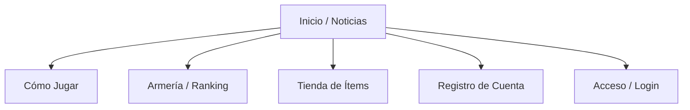
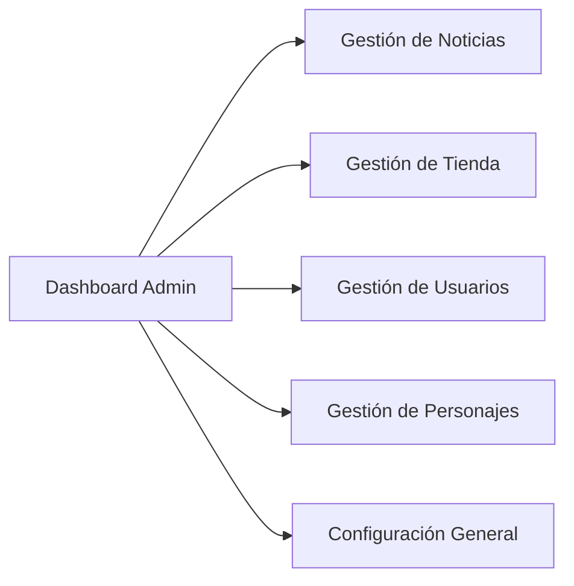

# Mapa de Páginas - SahtoutCMS

A continuación se detalla la estructura principal de tu sitio web para que sepas dónde está cada sección.

## 🌐 Sitio Público (Front-end)
Estas son las páginas que ven todos los usuarios:

- **Noticias:** `index.php` (Muestra las últimas novedades).
- **Cómo Jugar:** `how_to_play.php` (Guía de conexión).
- **Armería:** `armory/` (Rankings de PvP y Arena).
- **Tienda:** `shop.php` (Compra de servicios e ítems).

## 👤 Área de Usuario
Solo accesible tras iniciar sesión:
- **Panel de Usuario:** `account.php` (Cambio de contraseña, email, ver personajes).
- **Votar:** `vote.php` (Ganar puntos votando por el servidor).

## 🛡️ Panel de Administración (Admin Panel)
Solo accesible para Administradores o GMs:

- **Dashboard:** Resumen de cuentas y estado del servidor.
- **Settings:** Configuración de Logo, Redes Sociales, SMTP (Email) y reCAPTCHA.
- **SOAP:** Ejecución de comandos directos al servidor de WoW.

## 📂 Estructura de Archivos Clave
- `includes/header.php`: El menú superior y el logo.
- `includes/footer.php`: El pie de página con enlaces y créditos.
- `assets/css/`: Todos los archivos de estilo (colores, tamaños).
- `languages/`: Archivos de traducción de textos.
